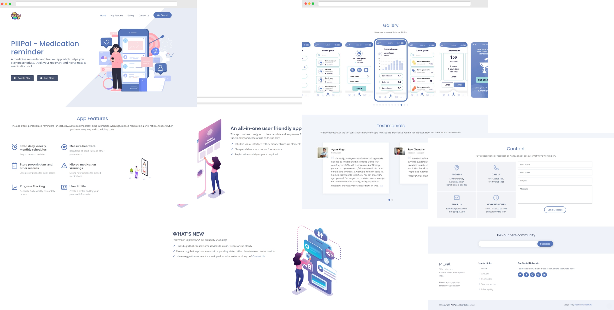

# PillPal

PillPal is a medicine reminder and tracker app whch helps you stay on schedule, track your recovery and never miss a medication slot.

### Features
- Fixed daily, weekly, monthly schedules
- Store prescriptions and other records
- Progress Tracking
- Measure heartrate
- Missed medication Warnings
- User Profile

## Landing Page 

Written in bootstrap, this page navigates you through using PillPal and its features
### Mockup

## Contributing
Pull requests are welcome. For major changes, please open an issue first to discuss what you would like to change.

## License
